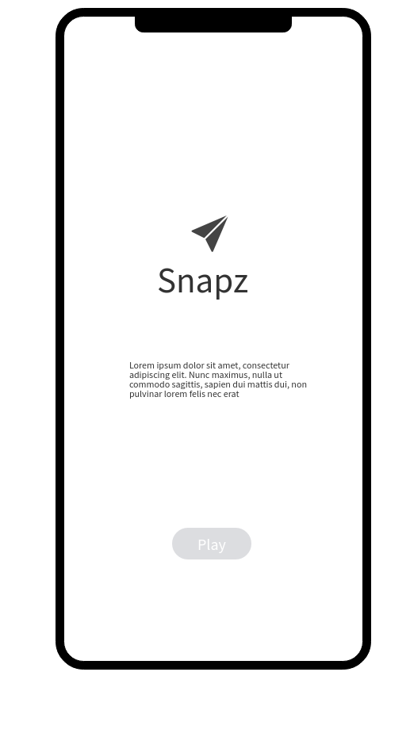
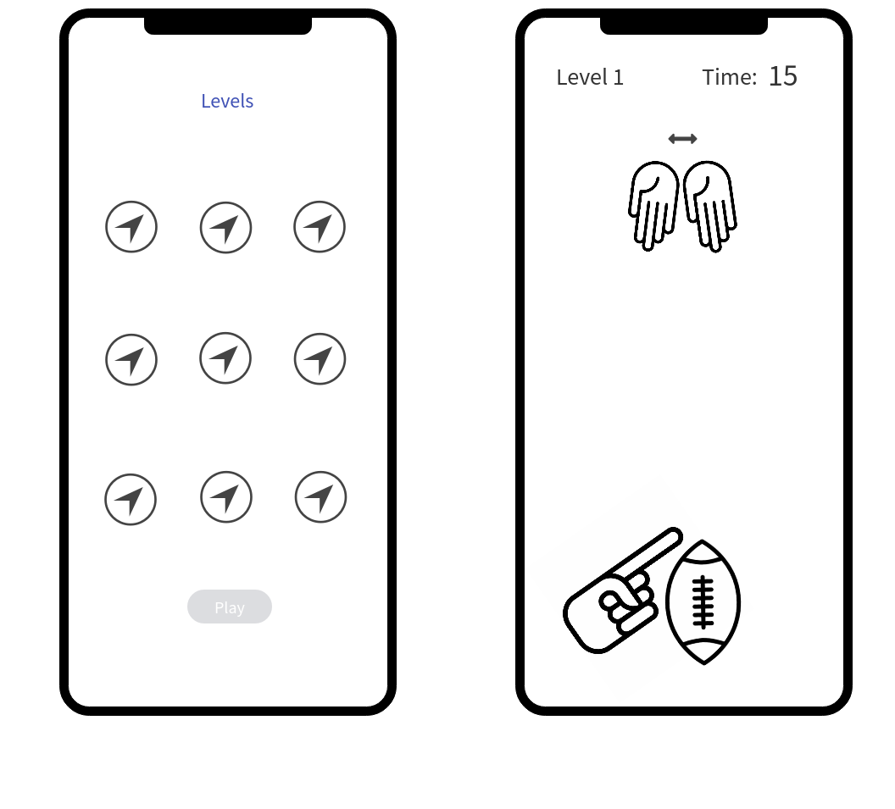
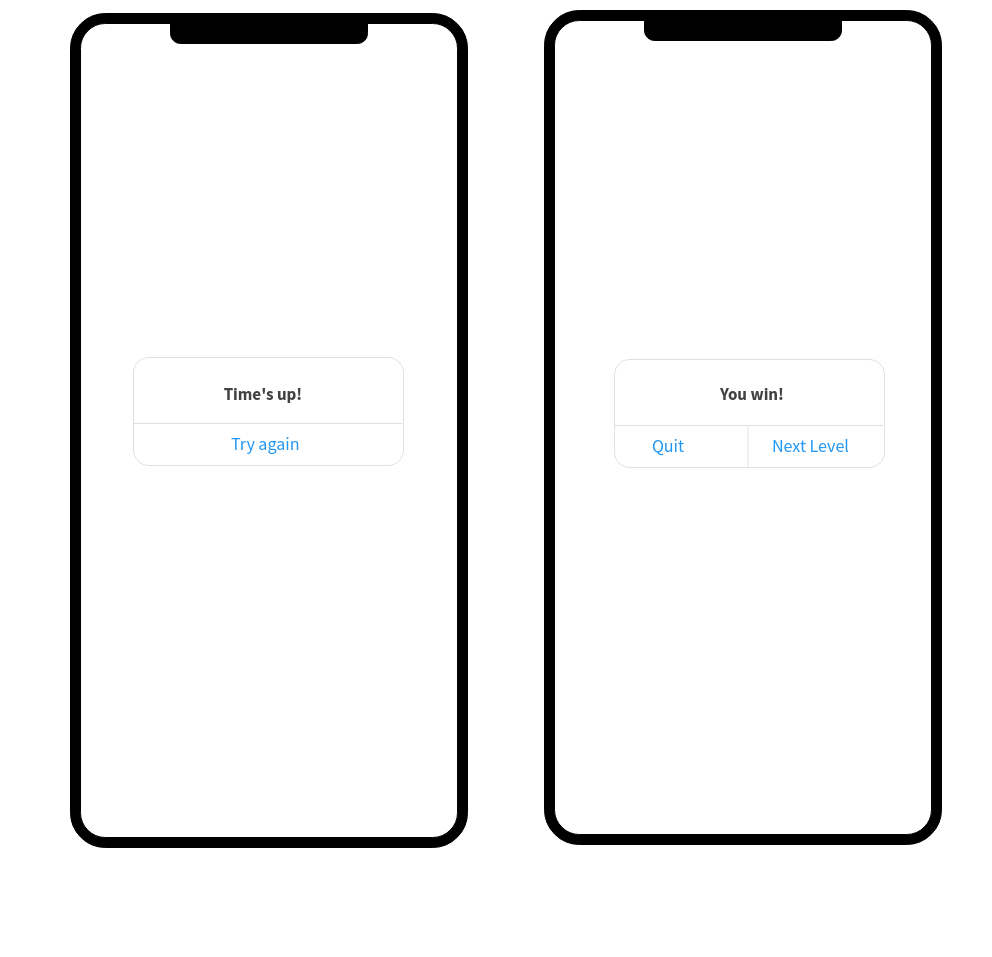

# snapz

Are you ready for some footballllllll?

It’s super bowl weekend and that means three things.  **Football.  Beer.  Commercials.**

Snapz is an iOS app created with these three things in mind.  Want to throw the football but don’t want to miss the commercials or give up the seat closest to the cooler?  Open Snapz and show off your accuracy skills to your friends.

# How to play:

In 15 seconds, see if you can flick three footballs into the moving hands at the top of the screen.  If you succeed, you will move on to the next level, where the hands will increase in speed.

# User stories: 

- A user should be able to click play on the main screen and be taken to the level page
- A user should only be able to play an unlocked level
- A user unlocks a level if he makes three successful passes in 15 seconds
- If a user does not succeed he will be given the option to try again or quit
- If a user succeeds he will be given the option to quit or move on to the next level

# Stretch goals:

- Add auth so users can log in and store level completion data
- Have a scoreboard so users can see how they compare to others that have completed the game

# Wireframes:

